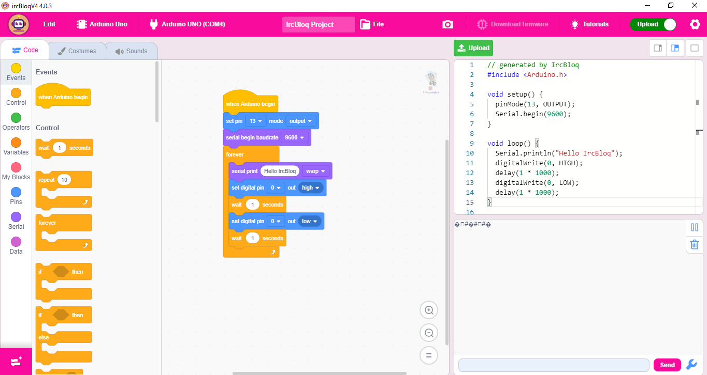

# Welcome to IrcBloqV4 Wiki

## Introduction

IrcBloqV4 is an open source graphics block programming software, which can be used for software programming or hardware device programming. It supports hardware code generation, compilation and download functions, and also supports a real-time operation mode realized by real-time communication with hardware devices.

## Hardware Support List

| Device Type | Device model                                                                                                           |
| ----------- | ---------------------------------------------------------------------------------------------------------------------- |
| Arduino     | Arduino UNO, Arduino Nano, Arduino Mini, Arduino Mega256, Arduino Leonardo, Arduino Esp32, NodeMCU, Arduino MakeyMakey |
| MicroPython | Micro:bit, Micro:bit V2, Maixduino, Raspberry Pico                                                                     |
| iRobochakra | Amingo, iBotV2                                                                                                         |

## Download Offline Version or Try Online

[Download software :fontawesome-solid-download:](./wiki/download-software.md){: .md-button  .md-button--primary} [Visit Online :fontawesome-solid-globe:](visit-online-version.md){: .md-button}

## Instructions for Use

[Normal user](normal-user/quick-start.md){: .md-button .md-button--primary }
