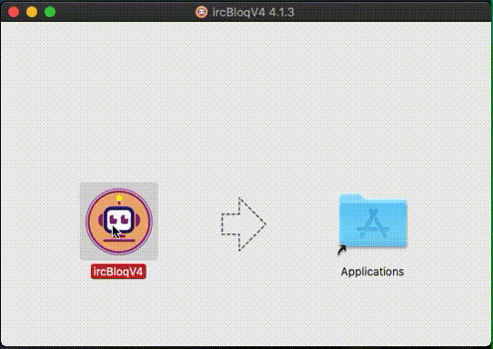
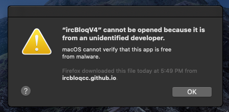
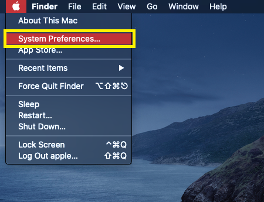
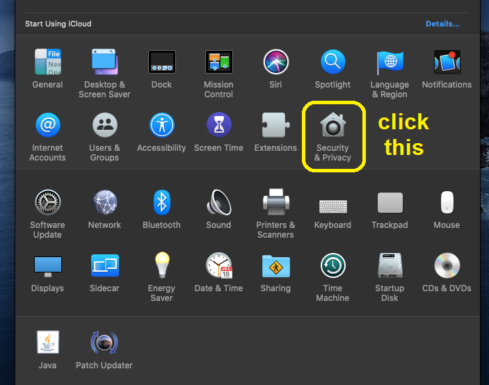
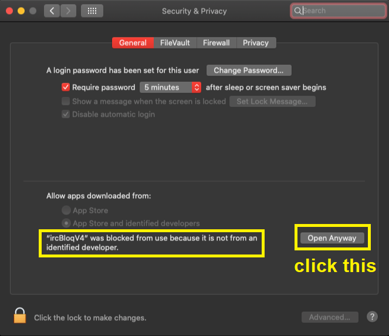
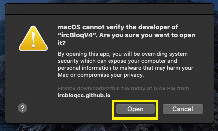

## Installation Procedure

1. Extract Downloaded application zip

2. Open Extracted IrcBloqV4Desktop.dmg File

3. Follow Below steps
	
	

4. After installation, if you get this error or warning

	
	
	!!! Note
		This error is causing because of Unidentified developer. As this ircbloq software has been developed by iRobochakra, you can follow this procedure. 
	
	Goto System Preferences...
	
	
	
	Click Security & Privacy
	
	
	
	Goto General Tab & Click Open Anyway
	
	
		
5. After finished above steps.Now you can open the software and give below as shown.

	
	
