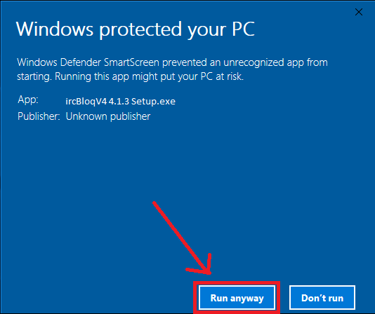

## Installation Procedure

1. Extract Downloaded application zip

2. Open Extracted IrcBloqV4 Setup.exe File and follow Below steps

3. Click **More info**
	
	

4. Click **Run Anyway**
	
	
	
5. Select **Anyone who uses this computer(all users)** and click **Next**
	
	
	
6. If below permission is asks, Give **Yes**.
	
	
	
7. Check the Destination Folder and Click **Install**
	
	!!! note
		Recommended location is **C:\ircBloqV4**
	 
	
	 
8. Then it will start Installing
	
	
	
9. Once installation completed, Select **Run ircBloqV4** and click **Finish**
	
	
