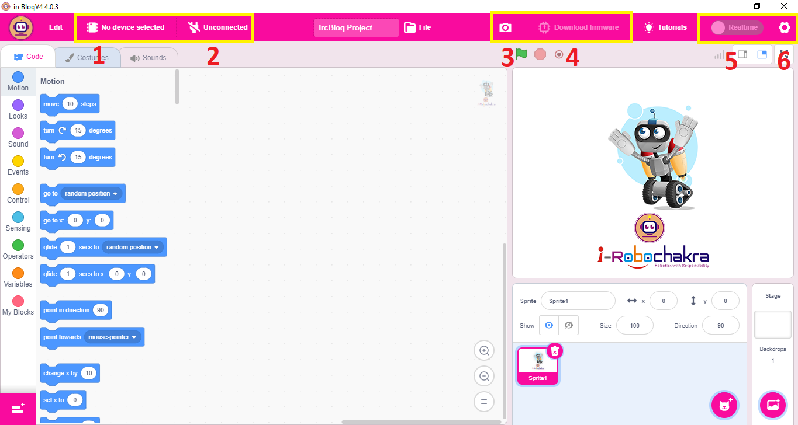

## Offline version

In the real-time mode, the software interface is mostly the same as SC3, and only the differences are introduced below.

1. Select the device

     Click this button to enter the device selection interface. Click and select the control panel you want to use.

2. Connect the device

     Open the device scan and connection interface.

3. Screenshot

     Capture the content of the current workspace and save it as a png image.

4. Download the firmware

     It is only available when the device supports real-time mode communication, and is used to download the real-time mode firmware corresponding to the device.

5. Switch programming mode

     The programming mode switch button can be switched to real-time mode or upload mode. If the device does not support switching programming modes, this button will be grayed out.

6. Settings

     - Check for update
        
         Check if there is an updated version of the extended resource
		 
	- Check for main update
        
         Check if there is an updated version of ircBloqV4
    
     - Clear cache and restart

         Clear the locally downloaded update and temporary files of the compiled project and restart the software

     - install driver

         Install the drivers of the hardware devices used in the software