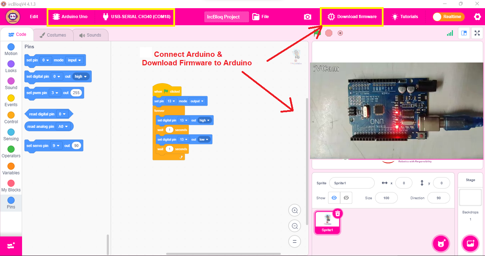
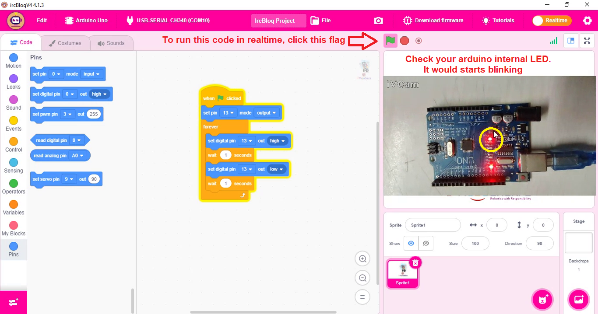
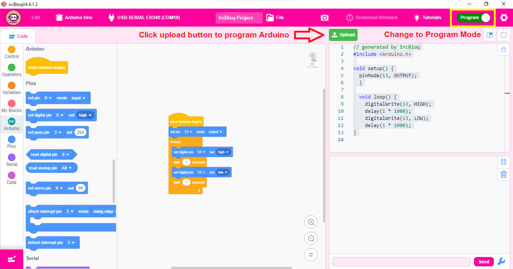
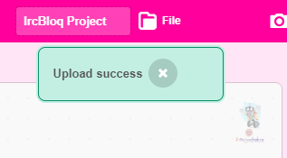

## **Real-time mode**

1. Start the software.

2. Click the device selection button.

3. Select Arduino Uno.

4. Connect the USB cable of the Arduino Uno control board.

5. Click the Connect button in the device scan and connection interface.

6. Write a simple LED blinking program and check below screenshots

	

7. Click the green flag to run the program.

	
	
	
	

## **Program mode**

1. Start the software.

2. Click the device selection button.

3. Select Arduino Uno.

4. Connect the USB cable of the Arduino Uno control board.

5. Change to Program mode and check below screenshots

	
	
6. Once upload done, you will get Upload Success

	

7. Then LED starts Blinking

	

